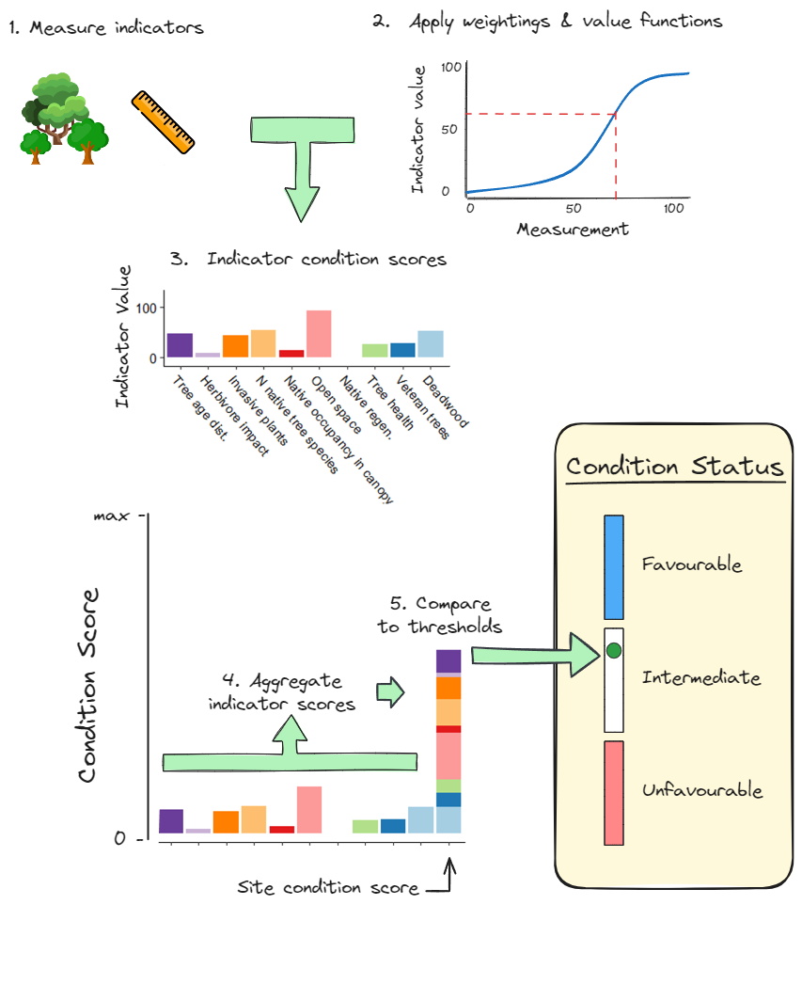

# Woodland-condition

This repository contains the code and data for analysis to inform The Woodland Trust's evolving approach to Woodland Condition assessment.

The repository is structured as follows:

-   Quorto book files, numbered. 'index.qmd' is the landing page:
    -   A page for each indicator, displaying the proposed measurement method, estimates of value functions and comments from the expert panel.
-   `Data/` contains the data used in the analysis:
    -   Excel forms, completed by expert woodland practitioners, containing data on their estimated value functions and weightings for different condition indicators
    -   data on appropriate tree and plant species for different types of site and woodland structure, adapted from The Woodland Trust's Tree Species Handbook.
-   `Scripts/` contains the scripts used to analyse the data:
    -   `functions_delphi_analysis.R` contains many of the the functions used repeatedly in the analysis
    -   `Extract_expert_info.R` extracts the expert information from the Excel forms
    -   `curation of extracted data.R` curates the extracted data
    -   `indicator tempalte.qmd` is used as a template for indicator pages of the Quorto book
    -   `Round 2 response checking.R` exploratory analysis of the second round of expert responses
    -   `Archive/` exploratory scripts and functions that were used in the analysis but are not part of the final analysis:
        -   `Delphi results processing.R` prelude to analysis of value functions and weights later used in Quorto book
        -   `heatmap script.R` initial exploratory work to investigate correlations between indicators and experts
